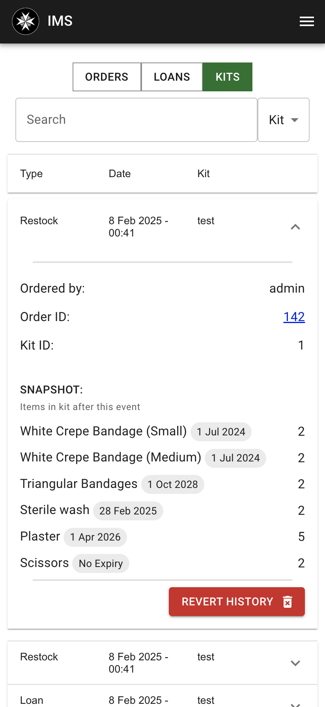

# View Transactions

| Item Orders | Loans | Kits |
|---|---|---|
|  |  |  | 

The View Transactions feature allows users to view all transactions in the system. Users can search for transactions, and filter transactions by type.

All actions that modify the inventory are recorded as transactions. This includes withdrawing, depositing, loaning, returning, and restocking items.