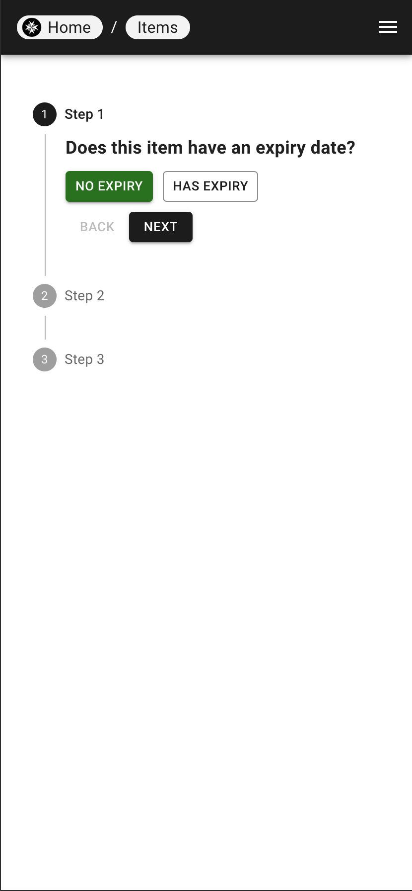
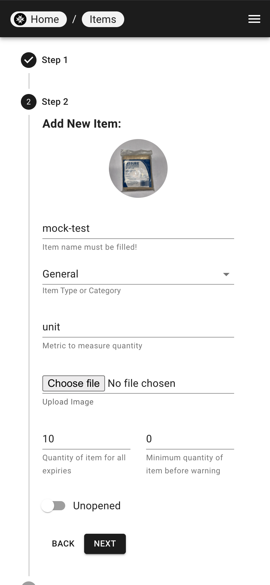
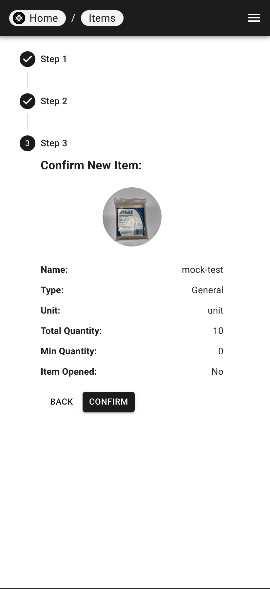

# Creating an Item

### Creating one item at a time

| Step 1 | Step 2 | Step 3 |
|---|---|--|
|  |  |  |

1. From the Items page, click on the hamburger icon in the top right corner, and select "Add new Item".
2. Follow the stepper prompts to fill in the item's information.
3. Click "Confirm" to create the item.

### Batch item creation

!!! warning
    Batch item creation is **not possible** without admin privileges.

1. From the Items page, click on the hamburger icon in the top right corner, and select "View Item List".
2. Click on the "Import" button.
3. A modal will pop up to upload a CSV file with the item information.

##### CSV File Format

[Download example CSV file](../../assets/example.csv)

!!! danger
    Batch item creation will result in multiple entries created in the transaction log. Reverting the batch creation will require reverting each individual item.