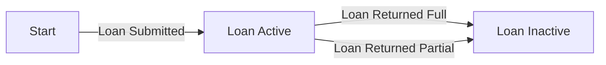
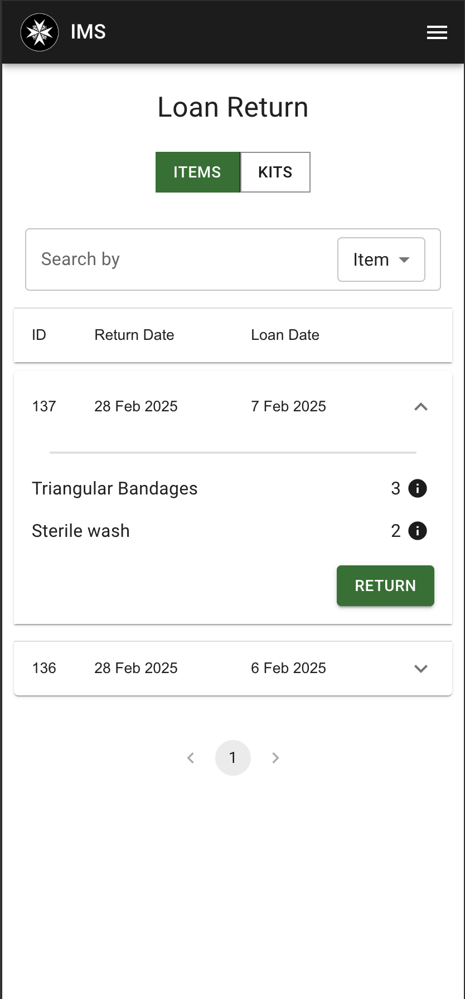
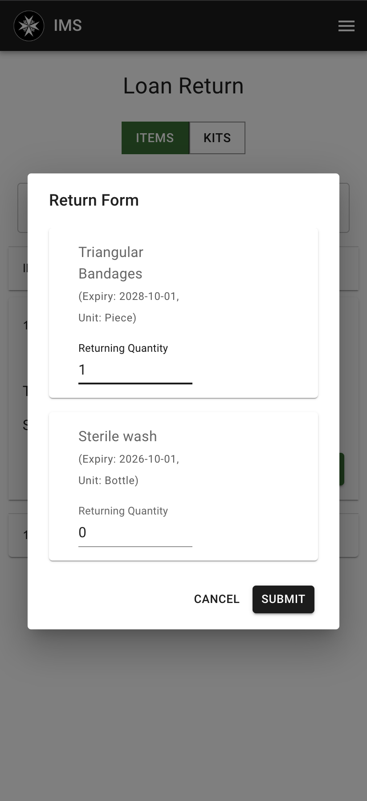

# Loaning Items

## Stages of Loan

When a user loans a collection of items, the loan is considered active until the user returns the items. The user can return the items in full or in part. If the user returns the items in full or in part, the loan is considered inactive.

If a user returns the items in part, it means that those items are expanded during the loan period.

!!! note
    We cannot do a partial return of items while still keeping the loan active. Once a loan is returned, the loan is considered inactive.

## Loaning Items

The process of loaning items is similar to the process of withdrawing items. See [Withdrawing Items](../items/withdrawing-depositing-items.md#withdrawing-items) for more information.

## Returning Items

| Step 1 | Step 2 |
|---|---|
|  |  |

1. At the homepage, click on the "Loans" button.
2. Toggle to the "Items" tab.
3. Select the loan you want to return.
4. A pop-up will appear showing the items in the loan, and allowing you to select the quantity to return.
5. After clicking on "Submit", the items will be returned and the loan will be updated.