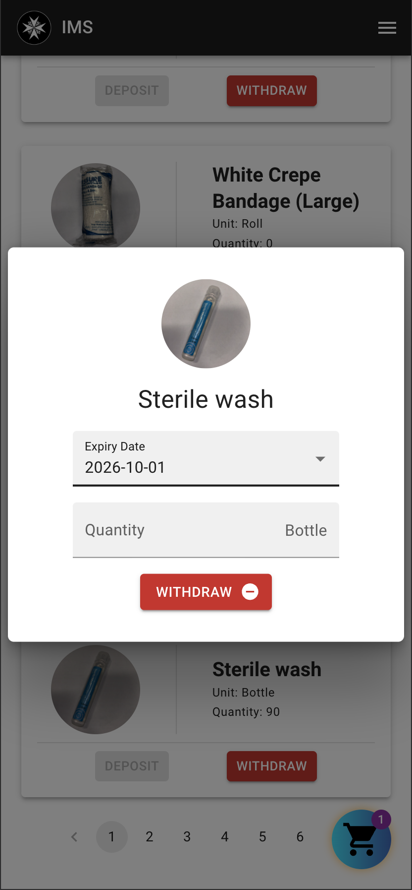
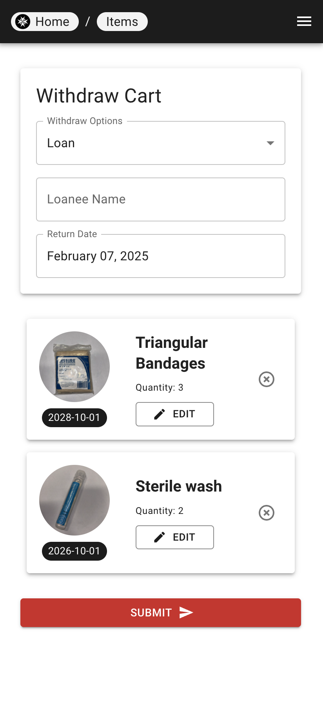
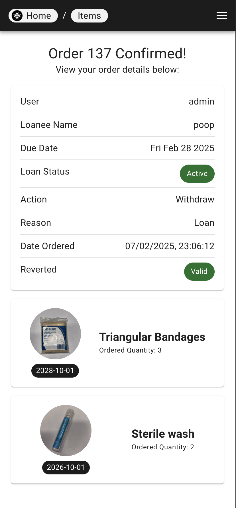
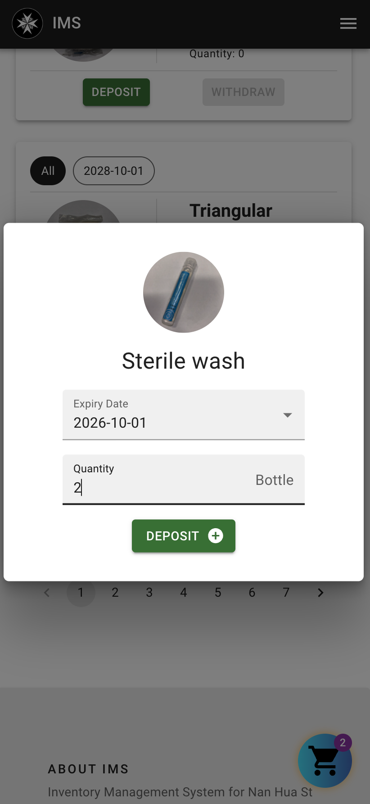
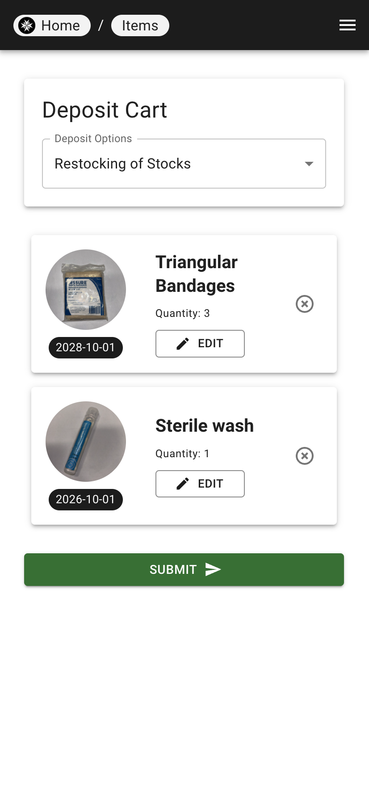
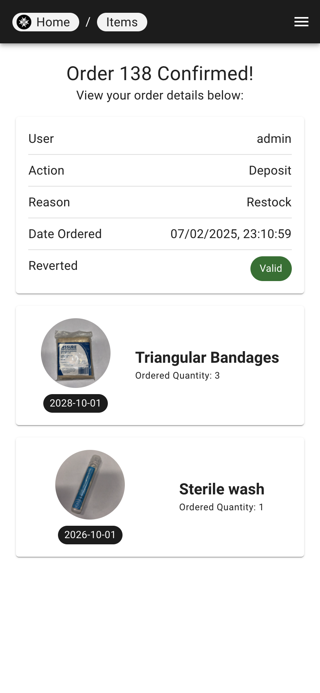
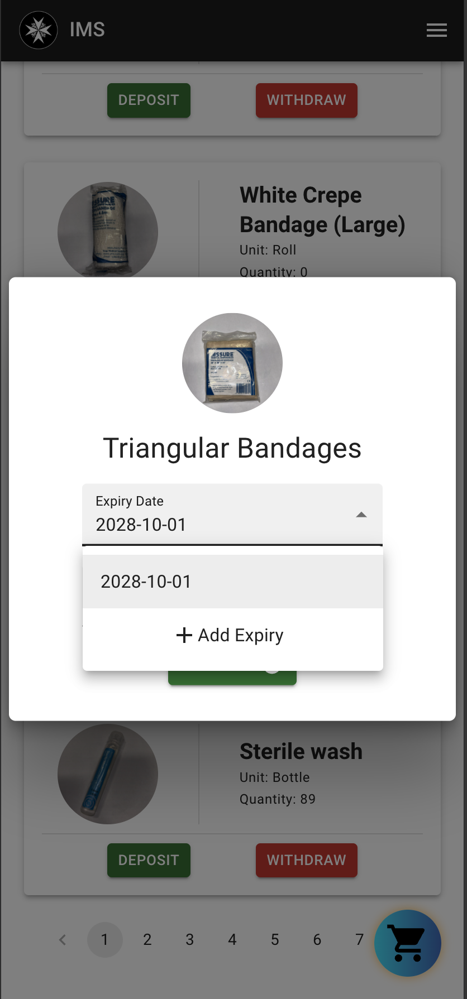
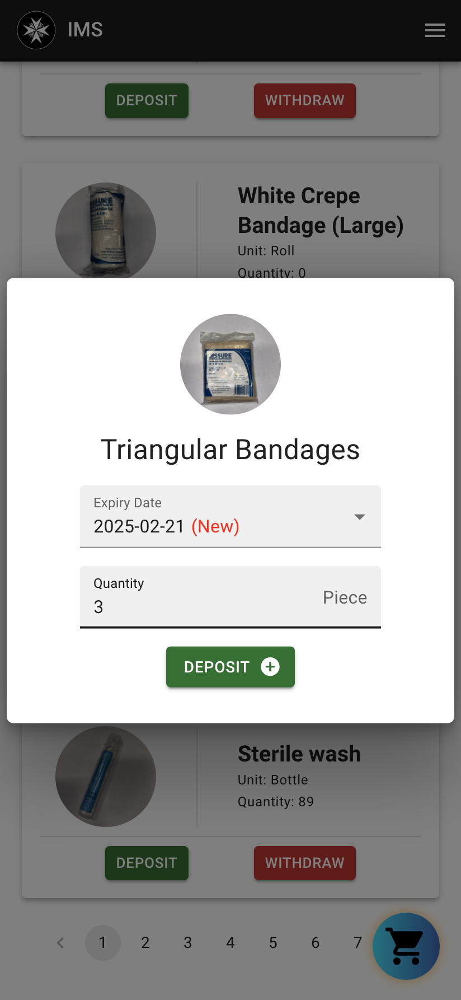
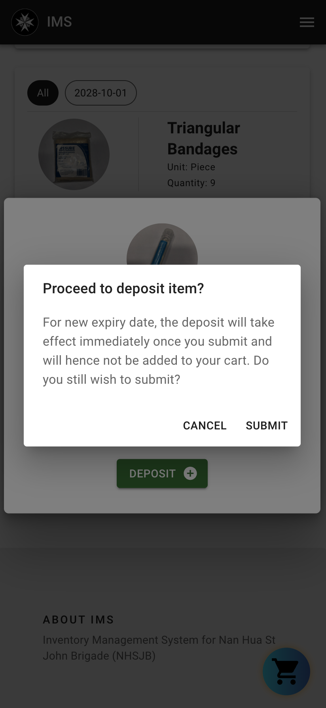

## Overview

The withdrawing and depositing items feature makes uses of a cart system to allow users to withdraw and deposit items in bulk. Users can add items to the cart, view the cart, and then withdraw or deposit the items in the cart.

!!! note

    If a withdraw item is in the cart, the user is unable to add deposit items to the cart and vice versa. The user must first withdraw or deposit the items in the cart before adding items of the opposite type.

## Withdrawing Items

| Add to cart | Checkout | Receipt |
|---|---|--|
|   |  |  |

1. Click on an item to withdraw.
2. A pop up will appear allowing you to select the expiry date of the item and the quantity to withdraw.

!!! note

    There are additional checks in place to ensure that the user does not withdraw more items than are available.

3. After clicking on "Withdraw", the item will be added to the cart.
4. To view the cart, click on the cart icon at the bottom right of the screen, or using the sidebar navigation (mobile) navbar (web).
5. In the cart, you can view and edit the items you have added, and the total quantity of items in the cart.
6. User can then select the purpose of the withdrawal and additional information if required and click on "Confirm" to withdraw the items.
7. A receipt will be generated and the items will be removed from the inventory.
8. A message will be sent to the telegram bot to notify the admin of the withdrawal.

## Depositing Items

| Add to cart | Checkout | Receipt |
|---|---|--|
|   |  |  |

1. Click on an item to deposit.
2. A pop up will appear allowing you to select the expiry date of the item and the quantity to deposit.
3. After clicking on "Deposit", the item will be added to the cart.
4. To view the cart, click on the cart icon at the bottom right of the screen, or using the sidebar navigation (mobile) navbar (web).
5. In the cart, you can view and edit the items you have added, and the total quantity of items in the cart.
6. User can then select the purpose of the deposit and additional information if required and click on "Confirm" to deposit the items.

### Depositing an Item with a new expiry date

!!! danger
    Unlike the regular deposit process, the item will not be added to the cart and will be immediately deposited.

| Step 1 | Step 2 | Step 3 |
|---|---|--|
|   |  |  |

1. Click on an item to deposit.
2. A pop up will appear, click on "Add new expiry date".
3. Select the expiry date and the quantity to deposit.
4. After clicking on "Deposit", a confirmation message will appear, click on "Confirm" to immediately submit the order.

!!! note
    The option to add a new expiry date will only appear if the item already has an expiry date.
    ie. If the item is a non-expiring item, the option to add a new expiry date will not appear.