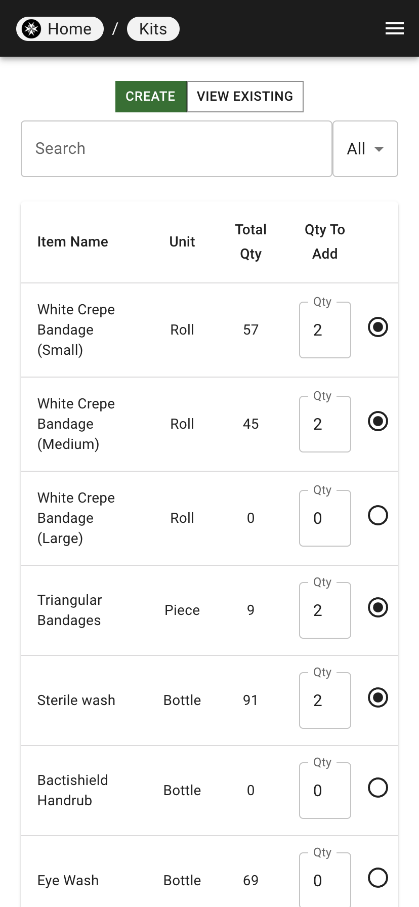
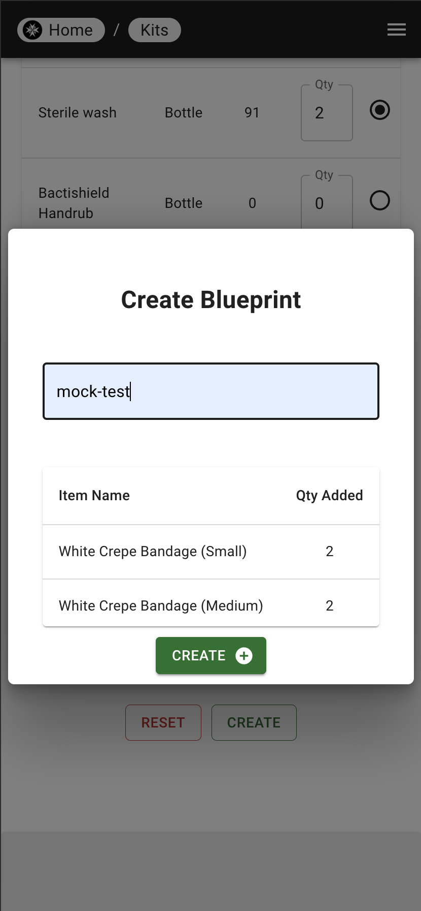

# Overview of Blueprints

Blueprints are a list of items and quantities required to create a fully stocked kit.

## Creating a Blueprint

| Step 1 | Step 2 |
|---|---|
|  |  |

1. Select the items and quantities required to create the kit.
2. Click "Save" and a modal will pop up to name the blueprint.
3. Click "Save" to create the blueprint.
