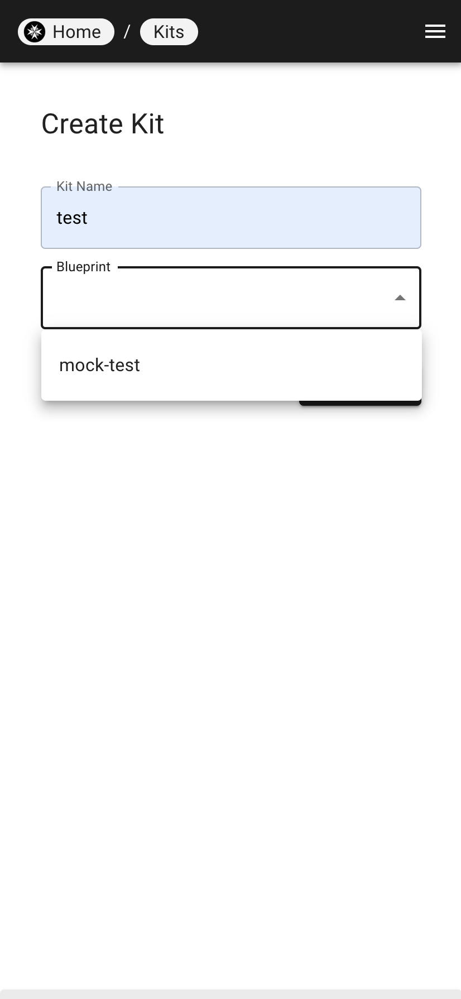
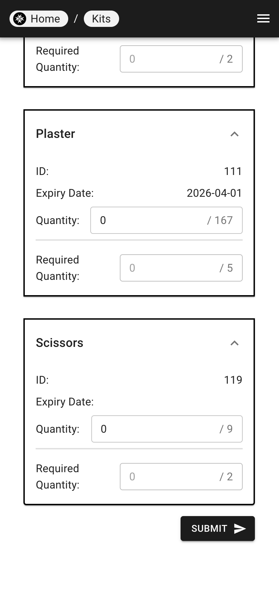

# Creating Kits

| Step 1 | Step 2 |
|---|---|
|  |  |

1. In the "Add new Kit" page, fill in the kit's name and select the blueprint from the dropdown list.
2. Once the blueprint is selected, the items and quantities will be displayed.
3. Fill in the quantities for each item in the kit.
4. Click "Submit" to create the kit.
5. The kit will be displayed in the "Kits" page.