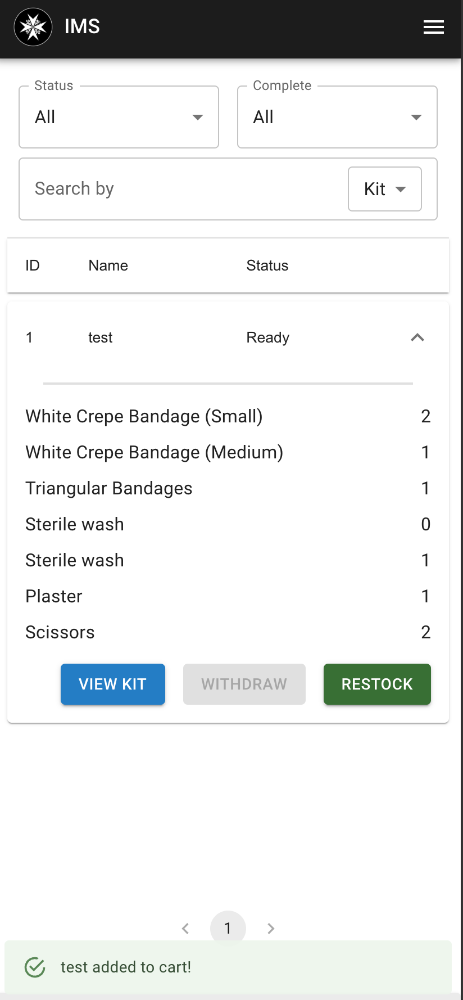
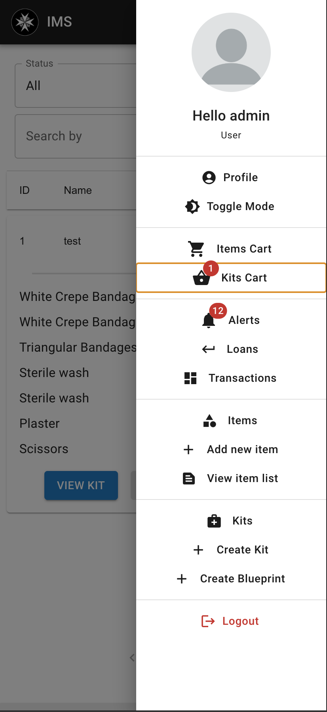
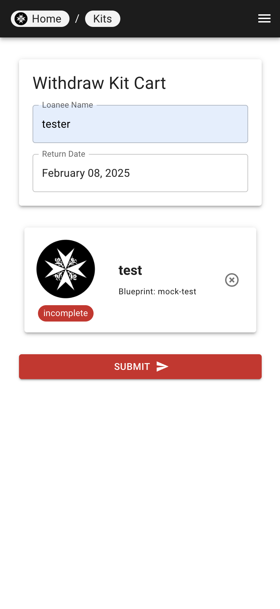

# Loaning Kits

The process of loaning kits is similar to the process of loaning items.

| Step 1 | Step 2 | Step 3 |
|---|---|--|
|  |  |  |

1. At the kit list page, select the kit(s) you want to loan.
2. Click on the "Withdraw" button, and the kit will be added to cart.
3. Click on the cart icon to view the cart
4. Fill in the loan details and click "Submit" to loan the kit.