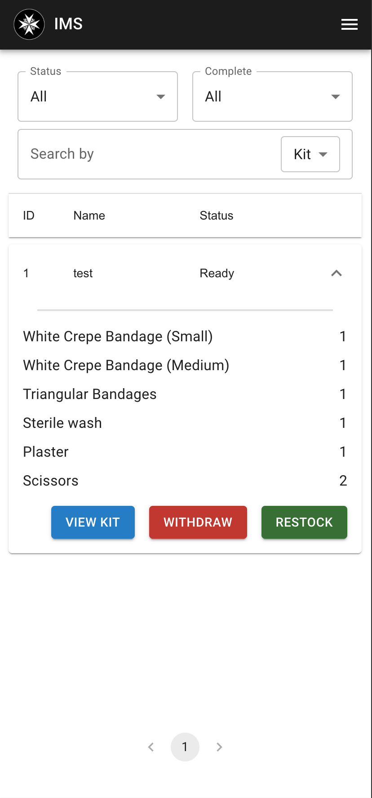

# Restocking Kits

| Step 1 | Step 2 | Step 3 |
|---|---|--|
|  |  |  |

1. At the kit list page, select the kit(s) you want to restock.
2. Click on the "Restock" button, and you will be redirected to the restock page.
3. Input the quantity of each item to restock into the kit and click "Submit".