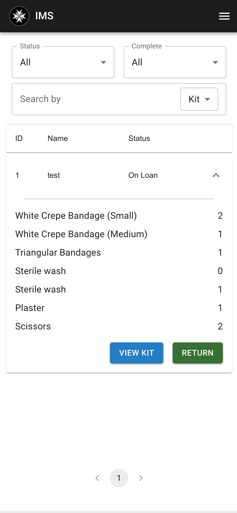
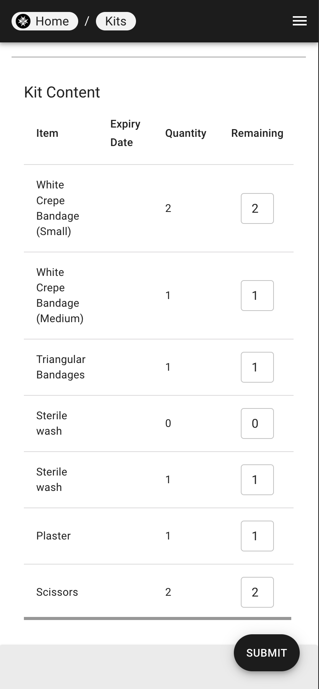
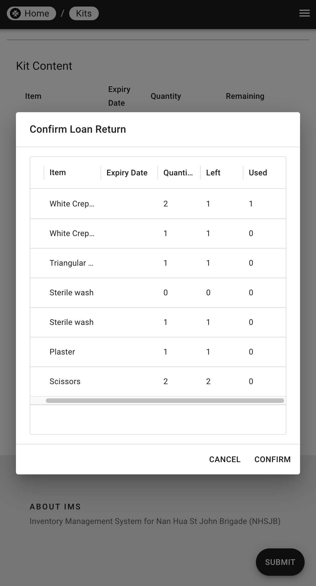

# Returning Kits

| Step 1 | Step 2 | Step 3 |
|---|---|--|
|  |  |  |

1. At the kit list page, select the kit(s) you want to return.
2. Click on the "Return" button, and you will be redirected to the return page.
3. Input the quantity of each item remaining in the kit and click "Submit".
4. A confirmation modal will appear, check the details and click "Confirm" to return the kit.