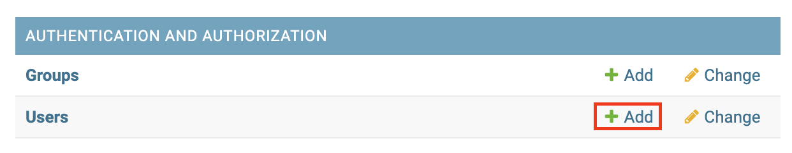
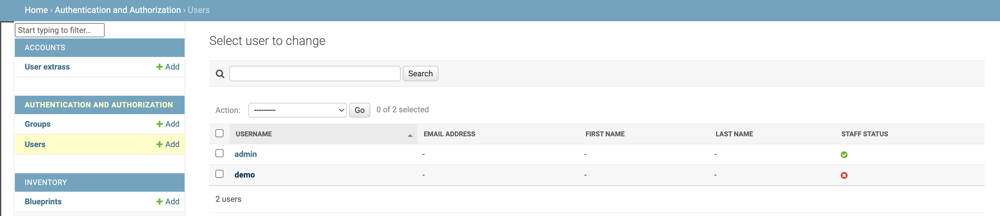
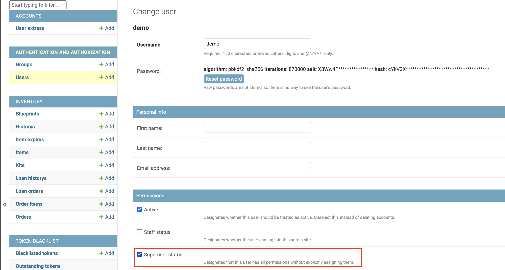

# Creating an Account

!!! warning

    Account creation is **not possible** without another admin user.

If you are an **admin user**, you can create an account for another user by following these steps:

### Creating a User Account

1. Visit the admin dashboard of the application.
    * If you are on the production site, visit [deck.nhhs-sjb.org/api/admin/](https://deck.nhhs-sjb.org/api/admin/).
    * If you are on the staging site, visit [deck-stg.nhhs-sjb.org/api/admin/](https://deck-stg.nhhs-sjb.org/api/admin/).
    * If you are on the development site, visit [deck-dev.nhhs-sjb.org/api/admin/](https://deck-dev.nhhs-sjb.org/api/admin/).
2. Log in with your admin credentials.
3. Under Authentication and Authorization, click on Add Users.
    
4. Fill in the user's information and click Save.
!!! note
    Password based authentication **must be enabled**

The new user will be created with the role of a regular user.

### Creating an Admin Account

1. Follow the steps above to create a user account.
2. After creating the user, click on the "Users" link in the sidebar, and select the user you just created.

3. Under the permissions section, check the box for "Superuser status" and click Save.

