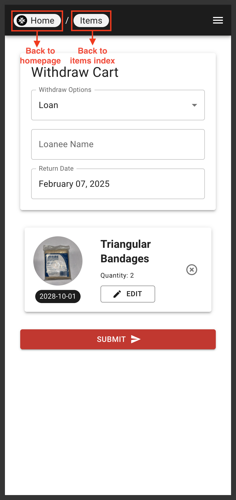

# Navigating the User Interface

## Navigation

Users can use the top left icon(s) as a pseudo-back button to navigate to previous page(s). The top right hamburger icon can be used to access the sidebar navigation menu which has links to all the pages in the application.

|  |  |
|---|---|

## Light/Dark Mode

The application supports both light and dark mode. Users can toggle between the two modes by clicking on the moon icon in the side navigation bar.

| Web | Mobile |
|---|---|
|  |  |