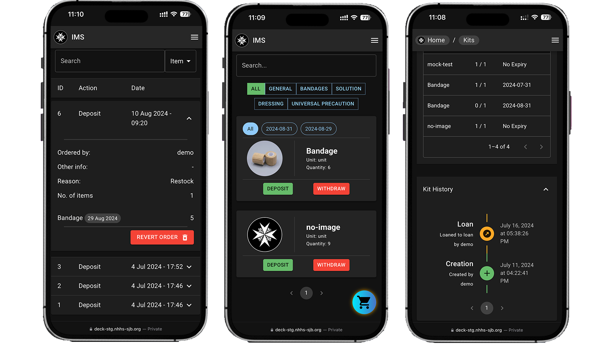

# Welcome to Deck

Deck is a comprehensive platform designed to streamline inventory management and order processing. It offers a robust set of features for managing items, orders, and user accounts.

### Key Features

* **Item Management**: Create, withdraw, deposit, and loan items.
* **Kit Management**: Create, restock, return, and loan kits.
* **Admin Dashboard**: View and manage all items, kits, and orders.
* **Alerts**: Receive notifications for low stock, expiring items and overdue orders.

### Useful Links

- [Live Site](https://deck.nhhs-sjb.org/)
- [Staging Site](https://deck-stg.nhhs-sjb.org/)
- [Developer Site](https://deck-dev.nhhs-sjb.org/)
- [Developer Documentation](https://sjb-deck.github.io/deck/)
- [API Documentation](https://sjb-deck.github.io/api-docs/)

### System Requirements

Deck is designed to be mobile responsive and can be accessed from any device with an internet connection. It is compatible with all modern web browsers.
