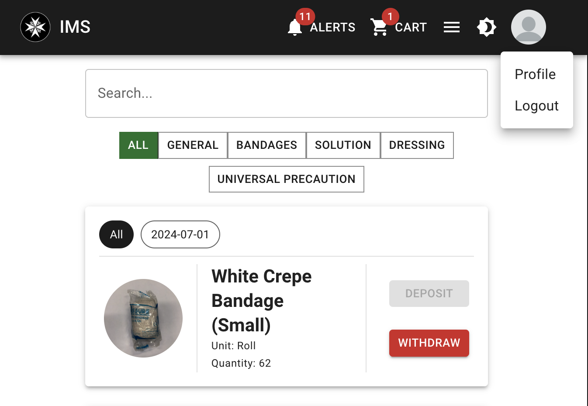
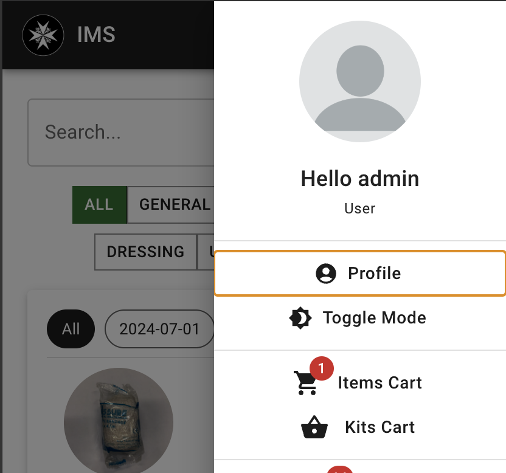

# Managing your account

| Web | Mobile |
|---|---|
|  |  |

1. Click on the user icon (web) or the hamburger icon (mobile) in the top right corner.
2. Click on "Profile"
3. You will be redirected to a page to edit your account information.

!!! note
    If a new profile picture is uploaded, you will need to logout and log back in for the changes to take effect.